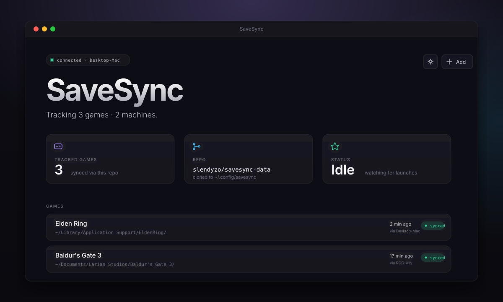

# SaveSync

A portable, cross-platform desktop app that syncs your game saves between
devices using a private git repo. Works with Steam, repacked games
(FitGirl / DODI), GOG, Epic, itch.io — anywhere Steam Cloud doesn't reach.

  

Save data lives in a private GitHub repo you own. SaveSync pushes when a
game closes, pulls before the next launch — across every machine you
install it on.

— **No backend.** Your repo, your token, your data.
— **No silent overwrites.** Conflicts preserve the loser on a labeled backup branch.
— **No installer.** Portable `.exe` / `.AppImage` you can run from anywhere.

## Install

1. Download the [latest release](https://github.com/slendyzo/savesync/releases/latest) — `.exe` for Windows, `.AppImage` for Linux.
2. Open it. Sign in with GitHub.
3. Pick the games. You're synced.

## Questions

Is this for piracy?

No. SaveSync syncs save files between machines. It doesn't download,
distribute, or modify games. Works identically with paid Steam titles,
GOG, itch.io, repacked games, mods — anything that writes to a save
folder.

What if I have changes on both machines?

Newest wins by save-file modification time. The older state is preserved
on a labeled backup branch — `backup/elden-ring/ROG-Ally-2026-05-12` —
so nothing is silently dropped. You can roll back any time.

## Reading further

- [Install + troubleshooting docs](web/INSTALL.md)
- [Contributing](https://github.com/slendyzo/savesync/issues) (issues + PRs welcome)
- [Landing page source](web/index.html)

---

MIT · [Slendy](https://github.com/slendyzo)
